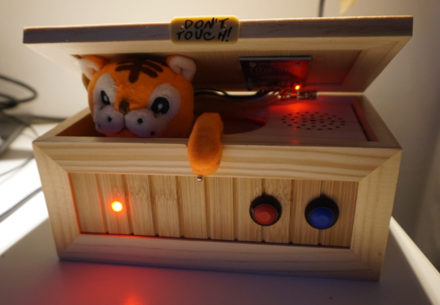

# Tiger player
This is control software for the awesome not-useless-anymore box, that is decked out to be able to control a Sonos
speaker system using NFC cards.



The main motivation for making this was to allow my kids to easily choose themselves what music to play on 
the Sonos speaker we have set up in their room, and when. I didn't want to just let them loose on a tablet/phone with
the full Deezer catalogue at this point, and I also wanted something that was more fun and easy to use. Enter the Tiger
player.

### Hardware used
* Raspberry Pi Zero W
* [RC522 RFID](https://www.amazon.de/dp/B071JTY28W/) reader
* ["Useless box"](https://www.amazon.de/dp/B077P4V1SV/)
* Two generic colorful push buttons
* A bunch of cheap MIFARE Ultralight C cards
* RGB LED
* [Sonos speaker](https://www.sonos.com/)

And then of course wire, glue, and the equipment/supplies needed for soldering all of this together.

### How does it work?
The RFID reader is glued to the underside of the lid of the box. The range of NFC is not great, but it does make it
through the thin wooden lid of the box. Whenever one of the NFC cards is put on top of the lid, the reader picks
up the ID and uses it to fetch the corresponding playlist from a [BuntDB](https://github.com/tidwall/buntdb) database.
The playlist is then submitted over UPnP to the Sonos speaker which starts playing the song(s). The two buttons on the
front can be used to skip to the next or previous tracks. When the card is removed from the lid, the playback on the
Sonos speaker is stopped.

## Building the code
To cross compile the go code to be run on the Raspberry Pi Zero W, issue:
```bash
$ GOOS=linux GOARCH=arm GOARM=5 go build -tags=pi
```
To build a cut down version that removes the hardware requirements on running on a Raspberry Pi with the RFID reader,
the binary can also be built witout build tags. This will generate some dummy button events, and log interactions with
the tiger and LED. Interaction with the sonos speaker is intact. 
```bash
$ go build
```

## Usage
```
usage: rpi-nfc-player [<flags>] <command> [<args> ...]

Music player that plays Deezer albums on a Sonos speaker with the help of NFC cards, a Raspberry Pi and
some buttons.

Flags:
  --help   Show context-sensitive help (also try --help-long and --help-man).
  --debug  Turn on debug logging.

Commands:
  help [<command>...]
    Show help.

  start --speaker=SPEAKER
    Start the music player and start listening for NFC cards.

  check
    Check all album/playlist entries and show problems.

  add [<flags>]
    Construct and add a new playlist to a card.

  dump [<flags>]
    Read a card and dump all the available information onto standard out.

  search <query>
    Search for albums on deezer

  label [<flags>]
    Create a label for a card.

```
start, and the variants of add, dump, and label where a cardId is not manually specified, must be run on the Raspberry
to work. The other can be run on any machine that can execute the go binary (and has an internet connection). 

## Contributing
If you feel like contributing with bug fixes or feature additions, PRs are welcome :yum:.

## Credits
To be able to put all of this together, I've relied on many _many_ search results from duckduckgo, but most importantly
the following:

* Craig Duncan for his [Sonos PHP library](https://github.com/duncan3dc/sonos). Without this one I would either have
spent an eternity trying to figure out the Sonos control, or then just plain given up.
* jdevelop's port of the Python [RC522 library](https://github.com/jdevelop/golang-rpi-extras/tree/master/rf522). This
functioned as the base for getting the RFID reader to work with the Ultralight cards.
* The frames for the card labels were downloaded from [Vecteezy.com](https://www.vecteezy.com)
